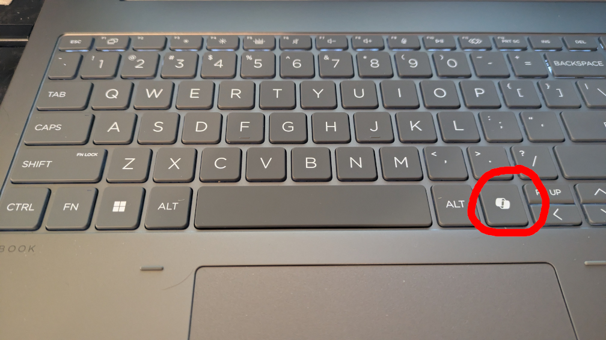

# Copilot Key Remap Script

## Justification
Newer version of HP (and presumably other, but this is the one I could verify functionality of) laptops now ship with a Copilot key in place of the right-Ctrl key.  This is infuriating.

It gets worse.  The key cannot be remapped by conventional approaches because of the way it is implemented on the hardware level.  On key down, the Copilot key emits Win + Shift + F23.  When held, it emits nothing.  On key up, it emits nothing.  

So to get around this, I put together this AutoHotkey script that runs in the background and will simulate Ctrl presses for most use cases.

## Use
This requires [AutoHotkey](https://www.autohotkey.com/) (v2.0 or later).  After installation, it can be run by associating .ahk files with AutoHotkey, by dragging the script file to the AHK executable, or by passing the script as an argument via CLI or a custom shortcut.

Beyond that, you may be interested in setting it to run automatically on start up.  The simplest way to do this is by creating a shortcut to `"<path to AutoHotkey64.exe> <path to copilot_button_remap.ahk>"` and placing it in your startup folder, most easily reached by opening a run prompt (win+R) and entering `shell:startup`.  Another alternative is to create a custom task in Task Scheduler (see elsewhere for instructions).

## Implementation Details
The script intercepts the Win + Shift + F23 key combination emitted by the Copilot key, then starts a timer.  If another key is pressed during the timer window, it simulates that key plus a Ctrl modifier.

Additional modifier keys will not trigger a simulated keystroke unless another non-modifier key is also pressed.  The modifiers will be preserved in the emitted key combination.

If the timer expires without another key press detected, no action is taken.

In Windows, Ctrl + Alt + Del is a special case that cannot be sent from a user-mode application (like this one), so the remapped key cannot be used in a 3-finger salute.  For my own preference, this combination is caught as a special case, which then launches Task Manager.  This takes care of most of the reason I would unthinkingly use this key in that combo.